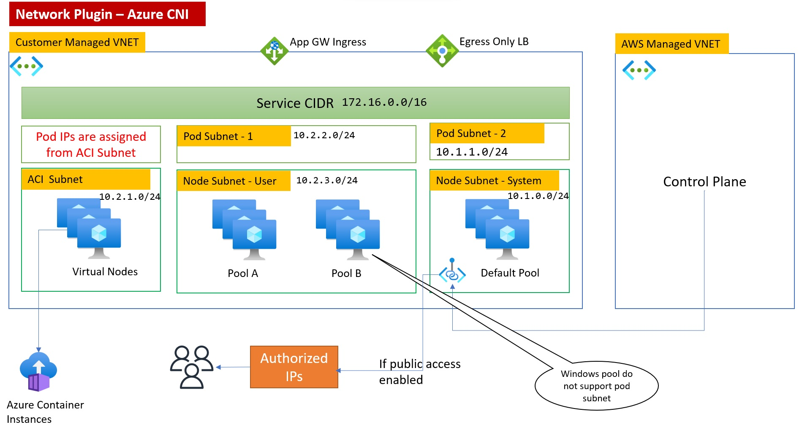

This repository is collection of various terraform modules and stacks to support creating e2e deployment Ex.`SQLServer on AzureVM`. 

# SQLServer on AzureVM
This stack can be used for learning excercise for `Terraform`. Detailed requirements are below:-

# Requirements
* Subnet creation needs to be generic, so we can create 1,2 or n
* VM can have multuiple network interfaces
* Each interface can have multiple ipconfigs
* Each ipconfig can have public iP
* NSG should be attached, but should be flexible to add multiple rules
* NSG rules should be able to handle both singular and plural options
* Should allow creation of multiple disks and disk attachments to VM
* Desk encryption should be supported (and optonal)
* Should support multiple VM configurations in one call

Below is how I have build this, the island is one group of resources which is created. Rest are created in separate caller module. This is like creating a landing zone and then VM.

So effectivly I am making `terraform apply` call twice.  

# AKS (In stacks foled)

This creates AKS cluster allowing user to enable disable various available feature including networking, policy, ingress, storage, autoscale. encryption etc.

This is detailed in this [blog](https://www.kamalsblog.com/2022/04/all-about-kubernetes-on-azure-aks.html)

